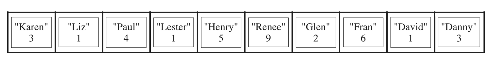
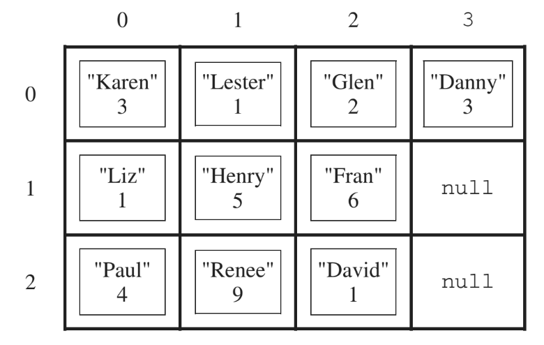
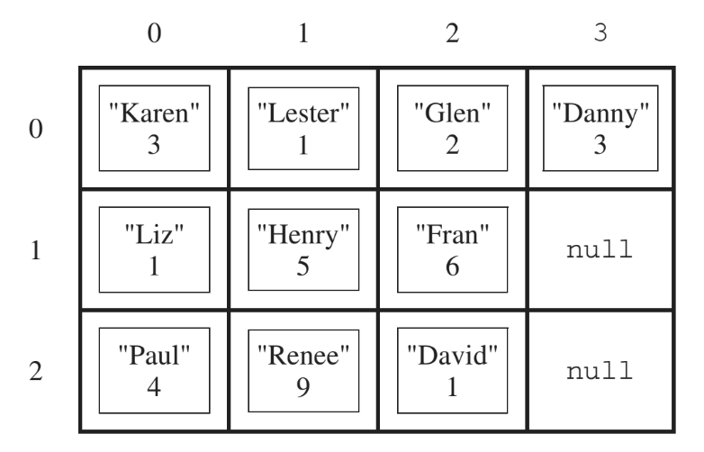
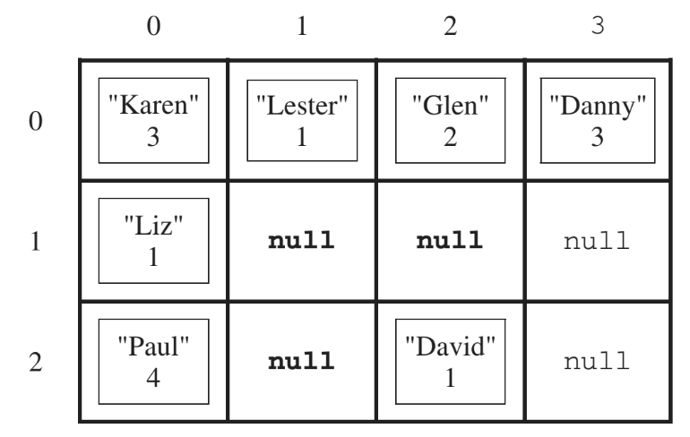

# Instruction

## Task 1
- Write the constructor for the `SeatingChart` class. The constructor initializes the `seats` instance variable to a 
  two-dimensional array with the given number of rows and columns. The students in `studentList` are copied into the
  seating chart in the order in which they appear in `studentList`.
  The students are assigned to consecutive locations in the array `seats`, starting at `seats[0][0]` and filling the
  array column by column. Empty seats in the seating chart are represented by `null`.
  
  For example, suppose a variable `List<Student> list` contains references to `Student` objects in the following order.
  
  
  
  A `SeatingChart`  object created with the call `new SeatingChart(list, 3, 4)` would have `seats` initialized with 
  the following values.
  
  
  

## Task 2
- Write the `removeAbsentStudents` method, which removes students who have more than a given number of absences from
  the seating chart and returns the number of students that were removed. When a student is removed from the seating
  chart, a `null` is placed in the entry for that student in the array `seats`.
  For example, suppose the variable `SeatingChart introOOP` has been created such that the array `seats` contains the 
  following entries showing both students and their number of absences.
  
  
  
  After the call `introOOP.removeAbsentStudents(4)` has executed, the array `seats` would contain the following values
  and the method would return the value 3.
  
  
  
